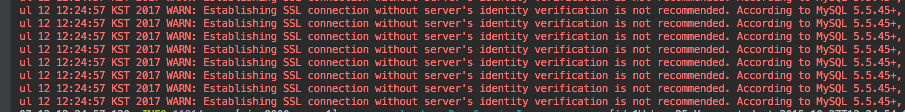

# 스프링과 데이터베이스 실습 - (1)

스프링에서 데이터베이스를 사용하려면 어떻게 해야할까? 나는 MySQL밖에 써본적이 없어서.. MySQL과 Spring을 어떻게 연동하는 지에 대해 적고자 한다.      

### Mybatis란?
Mybatis란 persistence framework이다. 즉 connection에 필요한 코드를 framework를 통해 좀더 간소화하여 관리할 수 있다는 장점이 있는 것 같다.

[공식문서](http://www.mybatis.org/mybatis-3/ko/)에 따르면 Mybatis는 다음과같이 말할 수 있다.
```
마이바티스는 개발자가 지정한 SQL, 저장프로시저 그리고 몇가지 고급 매핑을 지원하는 퍼시스턴스 프레임워크이다. 마이바티스는 JDBC로 처리하는 상당부분의 코드와 파라미터 설정및 결과 매핑을 대신해준다. 마이바티스는 데이터베이스 레코드에 원시타입과 Map 인터페이스 그리고 자바 POJO 를 설정해서 매핑하기 위해 XML과 애노테이션을 사용할 수 있다.
```


### Configuration in Spring Boot
Spring Boot에서 MyBatis를 사용하면 아주 편하다. 설정해줄 것이 많지 않다.
[공식문서](http://www.mybatis.org/spring-boot-starter/mybatis-spring-boot-autoconfigure/#)에 따르면 Spring Boot에서 Mybatis를 사용하기 위해 추가하는 dependency 'mybatis-spring-boot-starter'는 Spring 에서는 개발자가 정해주어야했던 다음의 것들을 설정해준다
- 존재하는 DataSource 자동 detection
- SqlSessionFactory의 인스턴스를 생성하고 등록하고 SqlSessionFactoryBean의 input으로 줌
- SqlSessionTemplate의 인스턴스를 생성하고 등록
- Mapper를 자동으로 스캔하고, SqlSessionTemplate으로 자동 연결해준다. 그리고 이를 Spring Context에 등록하여, bean으로서 inject될 수 있게 해준다

##### SqlSessionFactory, SqlSessionFactoryBean, 그리고 SqlSessionTemplate
[Mybatis API Doc](http://www.mybatis.org/mybatis-3/apidocs/reference/org/apache/ibatis/session/SqlSessionFactory.html)
###### SqlSessionFactory
SqlSessionFactory는 connection이나 datasource의 session을 생성한다
###### SqlSessionFactoryBean
SqlSessionFactoryBean은 Mybatias SqlSessionFactory를 생성하는 FactoryBean이다. 일반적으로 이를 통해 Spring에서 사용하는 SqlSessionFactory를 생성할 수 있다.
###### FactoryBean과 Bean
여기서 FactoryBean과 Bean의 차이점을 짚고 넘어가자. FactoryBean은 어떤 종류의 객체라도 ApplicationContext에서 사용할 수 있도록 해준다는 의미에서 간접적인 계층을 추가하는 Bean이다 [[1]](http://whiteship.tistory.com/564) . FactoryBean이 왜 필요하냐면, 앞서 [스프링의 기본 (1)](2017-07-12-Spring-1.md)에서 본것 처럼, DI를 위해서는 생성자를 이용한 방법과 getter/setter를 이용한 방법으로 injection이 가능하다. 그런데 두가지 경우로 injection이 불가능한 경우(어떤경우가 있는 지 추가바람)가 존재할 수 있다. 이럴 때 FactoryBean을 사용한다. FactoryBean을 통해서 객체를 구현하여 Bean으로 등록할 수 있는 것 같다.
``` Java
public class SimpleFactoryBean implements FactoryBean {

  public Class getObjectType() {
    return TestBean.class;
  }

  public boolean isSingleton() {
    return false;
  }

  public Object getObject() {
    return new TestBean("Alef [factory]");
  }
}
```
getObjectType()은 return하는 객체의 타입을 말해준다.
isSingleton은 싱글톤으로 관리되는지 아닌지를 말해준다
getObject는 객체를 만들어준다. ([코드참고](http://whiteship.tistory.com/564))
실제 FactoryBean interface는 다음과 같이 구현되어 있다
```Java
public interface FactoryBean<T> {
    // T type으로 return
    T getObject() throws Exception;

    Class<?> getObjectType();

    boolean isSingleton();
}
```
뀨 글이 길어졌네..^^..

###### SqlSessionTemplate
이건 트랜잭션에 대해 알아야할 것 같다.[참고](http://barunmo.blogspot.kr/2013/06/mybatis.html)

참고 : FactoryPattern

따라서 Spring Boot에서 Mybatis를 사용할 때 설정에 관한 부분은 의존성 추가만 해주면 된다.

### Mybatis
앞서 말했듯, Mybatis는 프레임워크이다. 다음의 구성으로 데이터베이스(여기서는 MySQL)와 연결할 수 있다.

#### set config
데이터베이스에 대한 설정을 해야한다. 스프링부트에서는 application.properties에 다음을 추가해준다

```
spring.datasource.url= jdbc:mysql://localhost:3306/{데이터베이스 이름}?autoReconnect=true&useSSL=false
spring.datasource.username=root
spring.datasource.password=password
```

autoReconnect=true&useSSL=false 이건 다음의 문제가 생겨서 구글 검색으로 찾은 해결법이다.


SSL 인증을 아예 무시해서 진행하는 주먹구구식의 해결법인것같아 다른 방법을 찾아봐야겠다.

#### Session Creation
데이터베이스와의 connection을 만든다. 아래의 Query Define의 방법에 따라 구현 방법이 다르다.
1. Query Define에서 XML을 사용할 경우
Query Define에서 XML을 사용할 경우 mapper가 XML로 구현되기 때문에 이를 알려주어야한다.
```Java
@Bean
    public SqlSessionFactory sqlSessionFactory(DataSource dataSource) throws Exception {
        SqlSessionFactoryBean sessionFactory = new SqlSessionFactoryBean();
        sessionFactory.setDataSource(dataSource);

        Resource res = new ClassPathResource("mapper/demo-query.xml");

        sessionFactory.setMapperLocations(new Resource[]{res});

        return sessionFactory.getObject();
    }
```
setMapperLocation을 통해 mapper의 위치를 지정해준뒤 이를 bean으로 등록한다.

2. JAVA를 쓰는 경우
mapper가 자동으로 찾기때문에 따로 처리해줄 필요가 없다. 이때는 DemoMapper에 의존성을 주입하여 이를 이용하여 메소드를 실행한다. @Autowired를 통해 선언해주라고 하는데..

#### Query Define
query를 정의한다. Mybatis의 장점은 프레임워크를 통한 중복 코드 최소화이다. 여기서는 쿼리문을 정의하여 변수를 바꾸어줌으로서 간단하게 사용한다.  

1. XML을 사용하는 방법
.xml 파일을 만든다. SpringBoot의 경우 resource 폴더 아래에 만들면 된다. <mapper>를 이용하여 쿼리문과 연결할 데이터를 표현하는 클래스(정확한 용어 확인)를 notation한다. id를 통해 쿼리문의 identity를 정의하고 안에 쿼리를 적는다. resultType은 결과로 반환할 타입, parameterType은 파라미터로 줄 타입을 뜻한다.

```XML
<?xml version="1.0" encoding="UTF-8"?>
<!DOCTYPE mapper PUBLIC "-//mybatis.org//DTD Mapper 3.0//EN" "http://mybatis.org/dtd/mybatis-3-mapper.dtd">

<mapper namespace="com.example.demo.UnSplashUrl">

    <select id="selectAll" resultType="String">
        SELECT url FROM image
    </select>

    <insert id="insertUrl" parameterType="String">
        INSERT INTO image (url) VALUES (#{value})
    </insert>

</mapper>
```


2. Java를 사용하는 방법
Mapper Class를 만든다. 그리고 쿼리를 정의한다. 예제코드는 다음과 같다. 아래와 같이 @를 이용하여 쿼리문을 지정해주고 (CRUD) 이를 함수와 mapping 시켜준다.
``` Java
@Mapper
public interface DemoMapper{

  @Select("SELECT url from image")
  public List<String> selectAll();

}
```

끝.. 이렇게 하면 데이터베이스 사용할 수 있음.

### Trouble Shooting 및 (내 기준)Issue

##### Mapper는 Bean 등록을 하지 않을까?
(등록을 한다면 왜 @Autowired가 먹히지 않을까? Mapper의 역할은?)
Mapper는 해당 Class가 Map임을 나타내기 위한 어노테이션이다. 그럼 Mapper Class를 통해 메소드를 사용하려면 어떻게 해야할까? 처음에는 @Autowired를 통해 빈을 찾아서 연결하려고 했는데, 동작은 되지만 등록된 빈이 없다고 자꾸 뜬다. @Component를 주면 해결이 된다. 어째뜬 쿼리문에 매핑된 메소드가 있으니 @Component를 통해 해결하는 게 맞을까..?!

사실 annotation을 이용한 프로그래밍이 낯설다. 이게 어떻게 인식해서 동작하는 것일까 궁금하다(나중에 찾아봐야지). 그리고 이를 알아야 해결이 좀더 생각해서 고민해볼 수 있을 것같다. 주말에 annotation관련해서 조금 공부/정리를 해보고싶다.

##### Component를 두개 annotation하면 어떻게 동작할까?
해볼 예정
##### Bean과 POJO의 차이
[여기](http://m.blog.naver.com/weekamp/186678831)에 의하면 같은 것이라고 한다..^^.. 그럼 왜 이름을 두개나 만들었담(그 이유도 설명되어 있네)
