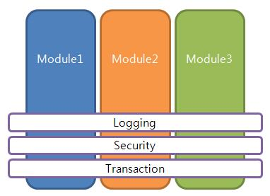

스프링의 3대장이 DI, AOP, 그리고 POJO이다. 이중 AOP에 대해 알아보자.   
## AOP란?
Aspect Oriented Programming의 줄임말이다. 스프링에서는 Bean을 사용하여 객체를 효과적으로 주입하고 관리함을 알고 있을 것이다. 그런데 절차지향처럼 순서가 필요한 경우는 어떡할까?    
즉, 기존의 스프링에서 지향하는 OOP의 경우 레고조립과 비슷하다. 필요에 의해 bean을 주입하여 원하는 프로그래밍을 할 수있다. 그런데 레고 모형 조립시 완성 전후로 A라는 행동을 지속적으로 해주어야 한다 가정하자. 예를 들어 현재까지 완성된 레고의 모습을 사진으로 찍어야한다고 하자. 그럼 어떻게 구현해야할까? 사진찍는 것을 빈으로 만들어서 레고 모형 조립 전후로 주입을 해주어야할까? 전후임을 어떻게 알까? 빈 자체에 코드를 삽입해줄까? 그러면 코드 중복이 너무 많이 발생한다.    
AOP는 이를 위한 것이다. 공통된 관심을 하나로 묶어서 로직사이에 끼워준다.



[AOP 설명 그림](http://cfs13.tistory.com/image/28/tistory/2009/06/17/14/18/4a387cb462407)

위 그림을 보면 module1, module2, module3이 모두 logging, security, transaction의 기능이 필요함을 알 수 있다. 각각의 모듈에 해당 코드를 삽입하기에는 코드중복이 많이 일어나므로, AOP를 사용하여 횡단 관심사를 묶어서 관리하는 것이다.

## AOP의 구현
그렇다면 AOP를 어떻게 사용할까? 오늘 프로젝트를 통해 구현한 내용을 바탕으로 설명하도록 하겠다. AOP의 사용 목적은, Controller 시작 앞뒤에 logging을 남기고자 하는 것이다.     
(controller 전후로 액션을 취하고자 한다면 interceptor를 사용해도 무방하다. 왜냐하면 interceptor는 controller를 앞에 위치하여 request를 controller에게 전달해주고 controller로부터 response를 받는다.)

AOP를 구현할 때 AOP임을 나타내주기 위해 `@Aspect`를 사용한다. 해당 어노테이션을 통해 AOP의 기능을 할 클래스임을 명시해준다. `@Aspect`를 사용할 때 줄 수 있는 옵션은 value가 있다    
(맥 기준 `command + B`를 누르면 해당 소스파일을 확인할 수 있다)   
value의 값을 지정하지 않을 경우 default로 해당 클래스는 singleton으로 동작하게 되고, `perthis`인 경우 value값으로 준 object 실행시마다 object를 생성한다. `pertarget`의 경우는 각 join point마다 object를 생성하고, join point마다는 singleton으로 동작한다. [참고자료](http://docs.spring.io/spring/docs/current/spring-framework-reference/html/aop.html#aop-instantiation-models)    
참고로 join point가 나온김에 몇가지 Aspect관련 용어를 살펴보자면
- adivce : 실행되는 object
- join point : Aspect가 실행되는 지점들
- point cut : Aspect가 실행된다고 지정한 지점들

join point와 point cut이 헷갈리는 데 이해한바에 따르면 예를 들어서 레고 조립 시작 전 사진을 찍는다고 지정하자. '레고 조립 시작 전'이 point cut이 된다. 그래서 실제로 내가 레고부품 A를 조립하기 전에 사진을 찍었다. 이 '레고 부품 A 조립전'이 join point가 된다. 실제 advice가 실행되는 지점이 join point고 join point는 point cut의 후보들이다. 이미지를 보면 조금 더 이해가 잘 갈 것이다. 참고자료 2에서 따왔다.


[참고자료1](http://devbox.tistory.com/entry/spring-AOP-용어-설명)     
[참고자료2](https://stackoverflow.com/questions/15447397/spring-aop-whats-the-difference-between-joinpoint-and-pointcut)

이제 `@Aspect`를 사용한 소스코드를 보자면 다음과 같다         

~~~JAVA        
@Aspect    
@Component     
public class LoggerAspect{      

    @Before("execution(* com.example.mumo.was.controller.*.*(..))")
    public void loggingBefore(JoinPoint joinPoint){
        log.info("before");
    }
    @After("execution(* com.example.mumo.was.controller.*.*(..))")
    public void loggingAfter(JoinPoint joinPoint){
        log.info("after");
    }

    @AfterThrowing("execution(* com.example.mumo.was.controller.*.*(..))", throwing = "e")
    public void loggingAfterThrowing(JoinPoint joinPoint, Throwable e){
        log.info("after throwing");
    }
}    
~~~      

`@Before`, `@After`, `@AfterThrowing`이 바로 point cut이다. 그 뒤에 붙은 것은 어떨 때 시작할 지에 대한 것이다. 코드를 설명해보자면, `@Before` 의 경우는 com.example.mumo.was.controller 패키지의 모든 클래스의 파라메터 제한 없이 모든 메소드가 실행 되기 전 loggingBefore를 실행하라는 의미이다.`@After`의 경우는 실행 후, `@AfterThrowing`의 경우 exception발생시 실행되는 코드이다.
이 point cut의 경우 표현식이 있다.    
[point cut 표현식](http://snoopy81.tistory.com/296)       
[이것도 정리 잘된 point cut 표현식](https://www.egovframe.go.kr/wiki/doku.php?id=egovframework:rte:fdl:aop:aspectj)

각각의 advice는 JoinPoint를 parameter로 받는다. 안받아도 되는데, 받으려면 첫번째 parameter로 지정해야한다. Join point는 호출되는 메소드에 대한 정보를 제공한다. 대상 객체, parameter등의 정보를 제공한다.     

```JAVA     
Object args[] = joinPoint.getArgs();
```    
